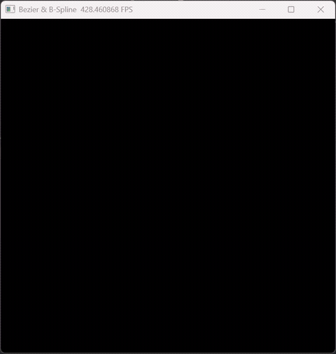

# 贝塞尔曲线与均匀三次B样条曲线渲染系统
基于 **Taichi** 实现的交互式曲线渲染程序，完整完成基础实验 + 两项附加题（反走样抗锯齿、均匀三次B样条曲线），支持GPU加速渲染与实时鼠标交互。



## 功能特性
- **基础实验**
  - 实现 De Casteljau 算法计算贝塞尔曲线
  - GPU 并行光栅化渲染，遵循显存批处理优化原则
  - 鼠标交互添加控制点、键盘清空画布
  - 控制点+控制多边形可视化绘制（对象池方案）
- **附加题 1：反走样（抗锯齿）**
  - 3×3 像素邻域距离加权渲染
  - 消除曲线锯齿，实现平滑边缘
- **附加题 2：均匀三次B样条曲线**
  - 基于基矩阵实现高效三次B样条计算
  - 支持局部控制点调整，对比贝塞尔曲线全局特性
  - 一键切换贝塞尔/B样条渲染模式

## 环境依赖
```bash
pip install taichi numpy
```
- Python 3.8 ~ 3.11
- Taichi（GPU 加速）
- NumPy

## 运行方式
1. 克隆/下载项目代码
2. 直接运行主程序：
```bash
python 你的文件名.py
```

## 交互操作
| 操作 | 功能 |
|------|------|
| 鼠标左键 | 在画布上添加控制点 |
| 键盘 `C` | 清空所有控制点与画布 |
| 键盘 `B` | 切换 **贝塞尔曲线 / 均匀三次B样条曲线** 模式 |

## 核心算法实现
### 1. De Casteljau 算法
递归线性插值计算贝塞尔曲线上的点，是贝塞尔曲线的标准求解算法。

### 2. 均匀三次B样条曲线
使用固定基矩阵实现，4 个控制点生成一段曲线，支持**局部控制**，解决贝塞尔曲线全局影响的问题。

### 3. 反走样（抗锯齿）
对曲线浮点坐标遍历 3×3 邻域像素，根据像素与曲线点的距离分配颜色权重，视觉上消除阶梯状锯齿。

### 4. 渲染优化
- CPU 批量计算所有曲线点，**一次性传输至 GPU**
- GPU 内核并行点亮像素，避免频繁CPU-GPU通信
- 固定大小显存对象池，适配现代图形渲染规范

## 项目结构
```
├── main.py          # 主程序（完整实现）
├── README.md        # 项目说明文档
└── requirements.txt # 依赖包
```

## 渲染效果
- 红色圆点：控制点
- 灰色线段：控制多边形
- 绿色平滑曲线：贝塞尔/B样条曲线（抗锯齿）
- B样条模式：仅受局部控制点影响，曲线更平滑、可控性更强

## 实验说明
本项目严格遵循图形学实验要求：
1. 理解贝塞尔曲线几何意义与 De Casteljau 算法
2. 掌握光栅化与像素缓冲区操作
3. 实现鼠标/键盘交互事件处理
4. 完成反走样与B样条曲线附加功能
5. 遵循GPU渲染性能优化原则